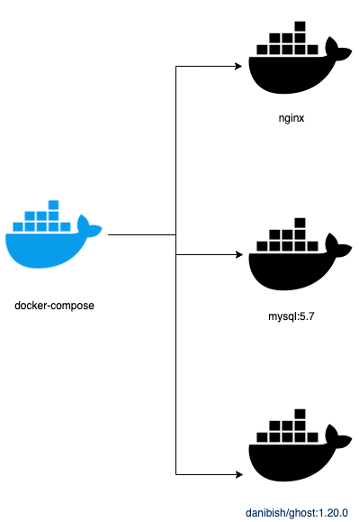

# Ghost with docker

currently setup points to daniblog.galileomtz.com, but the machine no longer exists. These files work for a future instantiation of a ghost blog with docker compose.

* NGINX
* MYSQL
* GHOST

## Features

- SSL certificate for a secure connection
- microservices architecture using Docker

## How to spin up your own blog in an ubuntu host

0. Create an Ubuntu VM
 
- with a public IP
- register the public IP with a domain that you own
- open ports 80 and 443 for web connection
- open port 22 for ssh connection

1. Install Docker

        sudo apt-get update

        sudo apt-get install \
            apt-transport-https \
            ca-certificates \
            curl \
            gnupg \
            lsb-release

        curl -fsSL https://download.docker.com/linux/ubuntu/gpg | sudo gpg --dearmor -o /usr/share/keyrings/docker-archive-keyring.gpg

        echo \
        "deb [arch=amd64 signed-by=/usr/share/keyrings/docker-archive-keyring.gpg] https://download.docker.com/linux/ubuntu \
        $(lsb_release -cs) stable" | sudo tee /etc/apt/sources.list.d/docker.list > /dev/null

        sudo apt-get update

        sudo apt-get install docker-ce docker-ce-cli containerd.io

        sudo docker run hello-world

2. Install Docker compose

        sudo curl -L "https://github.com/docker/compose/releases/download/1.29.2/docker-compose-$(uname -s)-$(uname -m)" -o /usr/local/bin/docker-compose

        sudo chmod +x /usr/local/bin/docker-compose

        docker-compose --version

3. Setup SSL for nginx

> mkdir -p /etc/ssl/private /etc/ssl/certs

This takes more than 5 minutes
> openssl dhparam -out /etc/ssl/private/dhparams_4096.pem 4096 

4. Generate certificates

        sudo apt install certbot python3-certbot-nginx

        domain=yourdomain.com
        email=youremail@email.com

        sudo certbot --nginx --agree-tos --redirect --hsts --staple-ocsp --email you@example.com -d yourdomain.com,www.yourdomain.com 

        sudo certbot --nginx --agree-tos --redirect --hsts --staple-ocsp --email $email -d $domain 

5. Edit docker compose files to update with your domain

 - docker-compose.yml
 - nginx/blog.cong

6. Run docker compose

> docker-compose --verbose up

7. Visit your site!

8. Debugging

Make sure nginx is not running outside of Docker and occupying the ports

> sudo netstat -tulpn

> sudo systemctl status nginx

### References

- https://github.com/gregbkr/ghost-nginx-ssl-docker

- https://www.linuxbabe.com/ubuntu/install-ghost-blog-ubuntu

- https://docs.docker.com/engine/install/ubuntu/

- https://docs.docker.com/compose/install/